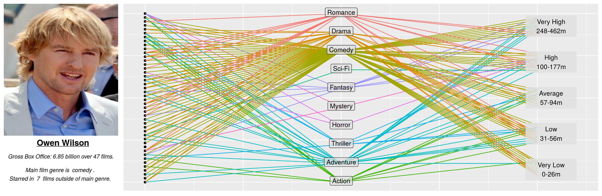
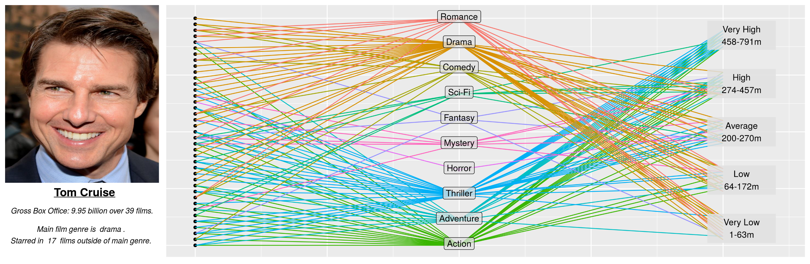

# typecast-analysis
This project is designed to illustrate how typec




## Usage
To recreate the results shown above for any actor; first download the repository zip file, extract it, and then navigate your terminal to the main folder. The data can then be gathered from Wikipedia and IMDB using the included python script. Simply open a python terminal and execute the following commands:
````
from RetrieveData import *
get_raw_data('Tom Cruise')
clean_data('Tom Cruise')
get_photo('Tom Cruise')
````
This will create a file in the *cleandata* folder that is appropriately formatted for our plotting function. To then produce the extended bipartite filmography graph, open an R terminal and execute the following commands:
````
source('CreateProfile.r')
plot_filmography('Tom Cruise')
````
### Known Bugs ###
The infobox data that is collected from Wikipedia's web pages can often contain odd formatting characters, this will cause the *clean_data* command to fail. I am working on expanding the *clean_data* function's ability to handle edge cases so that the user will not have to do any formatting corrections themselves. For now, it is advisable to check the outputted file from *get_raw_data* (located at rawdata/actorname.csv) and delete misaligned rows before executing the *clean_data* command. 

